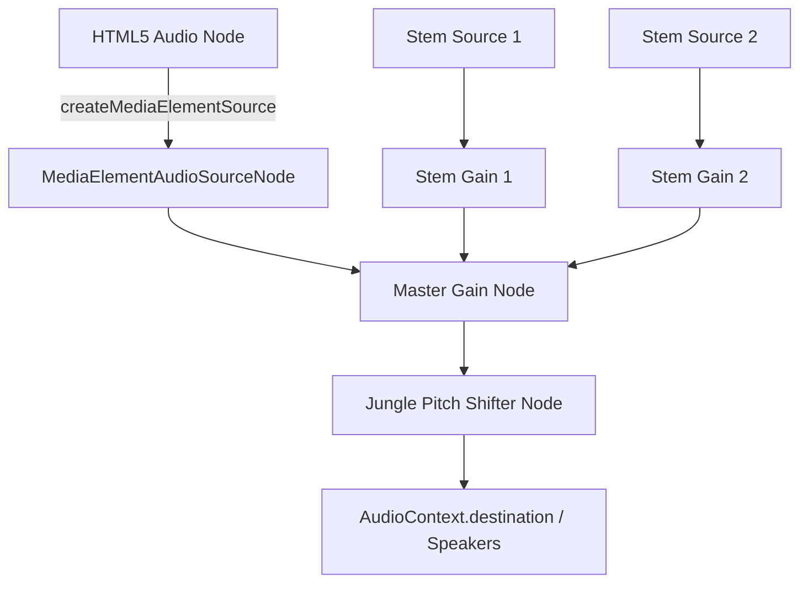

# Spec: Audio Speed and Pitch Adjuster (Client-Side)

This specification outlines the technical design for adding real-time audio speed (playback rate) and pitch control to the music practice interface. It will run entirely client-side using the Web Audio API and a granular delay-based pitch shifter.

---

## Architecture Design

To allow independent control of speed and pitch for both the main audio (HTML5 `<audio>` element) and the instrument stems (Web Audio `AudioBuffer` source nodes), we will route all audio sources through a single Web Audio graph.

### Audio Routing Chain

### Key Technical Details

1. **Jungle Pitch Shifter:** 
   We will adapt [jungle.js](file:///c:/Users/Hewlett%20Packard/Desktop/Gerald/Enyao_website/src/utils/jungle.js) to be an ES module. It will take an `AudioContext` and output a custom subgraph with `.input`, `.output`, and a `.setPitchOffset(mult)` method.
   * `mult` is computed from semitones. A pitch shift of $S$ semitones translates to a multiplier offset:
     * For $S < 0$: $mult = S / 12$
     * For $S \ge 0$: $mult = a_0 + a_1 S + a_2 S^2 + a_3 S^3 + a_4 S^4 + a_5 S^5$ (using the polynomial from standard jungle.js).

2. **Speed & Pitch Synchronization:**
   * **Main Audio CORS:** To route the `<audio>` element through Web Audio `AudioContext`, we must set `audio.crossOrigin = "anonymous"`.
   * **Speed Change:** Changing playback speed sets `audio.playbackRate = speed` on the main audio element and `src.playbackRate.value = speed` on active stem sources.
   * **Compensation:** By default, changing playback rate on `AudioBufferSourceNode` changes both speed and pitch (tape recorder effect). To ensure speed adjustment remains independent of pitch:
     * We will set `audio.preservesPitch = false` on the main audio element so that it also acts like a tape recorder (shifting pitch in exact lockstep with the stems).
     * We will then apply a pitch-shift offset on the mixed output via the `Jungle` node to compensate for the speed-induced pitch change, achieving a clean pitch-preserving speed shift!
     * The net pitch shift applied by the `Jungle` node will be: 
       $$\text{Net Pitch Shift (semitones)} = \text{User Pitch} - (12 \times \log_2(\text{Speed}))$$

---

## Proposed Changes

### 1. [NEW] [jungle.js](file:///c:/Users/Hewlett%20Packard/Desktop/Gerald/Enyao_website/src/utils/jungle.js)
* Convert the downloaded file to an ES Module exporting the `Jungle` class.

### 2. [MODIFY] [PlayerContext.jsx](file:///c:/Users/Hewlett%20Packard/Desktop/Gerald/Enyao_website/src/lib/PlayerContext.jsx)
* Add `speed` and `pitch` states (default `1` and `0` respectively).
* Import `Jungle` and initialize `pitchShifterRef` on `ensureAudioCtx`.
* Connect `masterGainRef` to `pitchShifterRef.input` and `pitchShifterRef.output` to destination.
* Route `audioRef` (main audio) into Web Audio via `createMediaElementSource` if not already connected.
* When playing stems or setting playback rates, apply the speed to `playbackRate.value`.
* Implement `changeSpeed(speed)` and `changePitch(pitch)` functions that update states, apply playback rate changes, and calculate/apply the new pitch offset on `pitchShifterRef`.

### 3. [MODIFY] [AudioPlayer.jsx](file:///c:/Users/Hewlett%20Packard/Desktop/Gerald/Enyao_website/src/components/practice/AudioPlayer.jsx)
* Consume `speed`, `pitch`, `changeSpeed`, and `changePitch` from `usePlayer()`.
* Add visual sliders for Speed (`0.5x` to `1.5x` in steps of `0.05`) and Pitch (`-6` to `+6` semitones in steps of `1`).
* Provide "Reset" buttons for both sliders to easily return to default values.

---

## Verification Plan

### Manual Verification
1. **Load Song:** Play a song with main audio only. Verify it plays normally.
2. **Speed Controls:** Adjust the speed slider. Verify tempo speeds up / slows down. Verify pitch remains identical to original.
3. **Pitch Controls:** Adjust the pitch slider. Verify the pitch shifts up and down.
4. **Stems Compatibility:** Load a song with instrument stems. Enable stem tracks. Verify that speed and pitch adjustments affect the stems and main audio equally and keep them in perfect synchronization.
